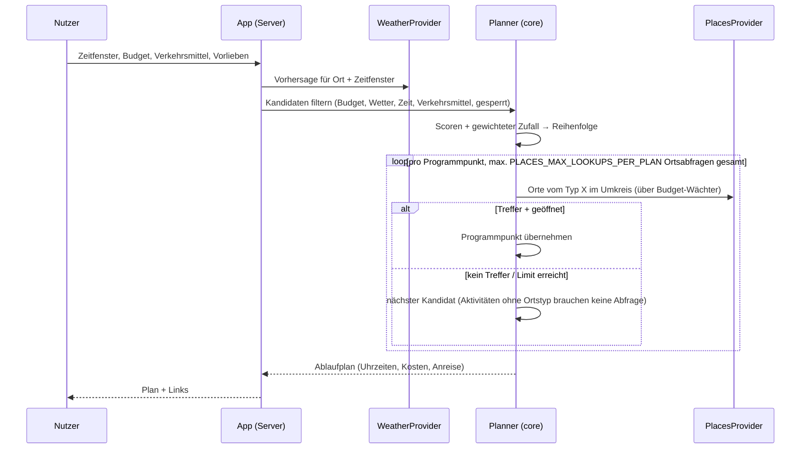
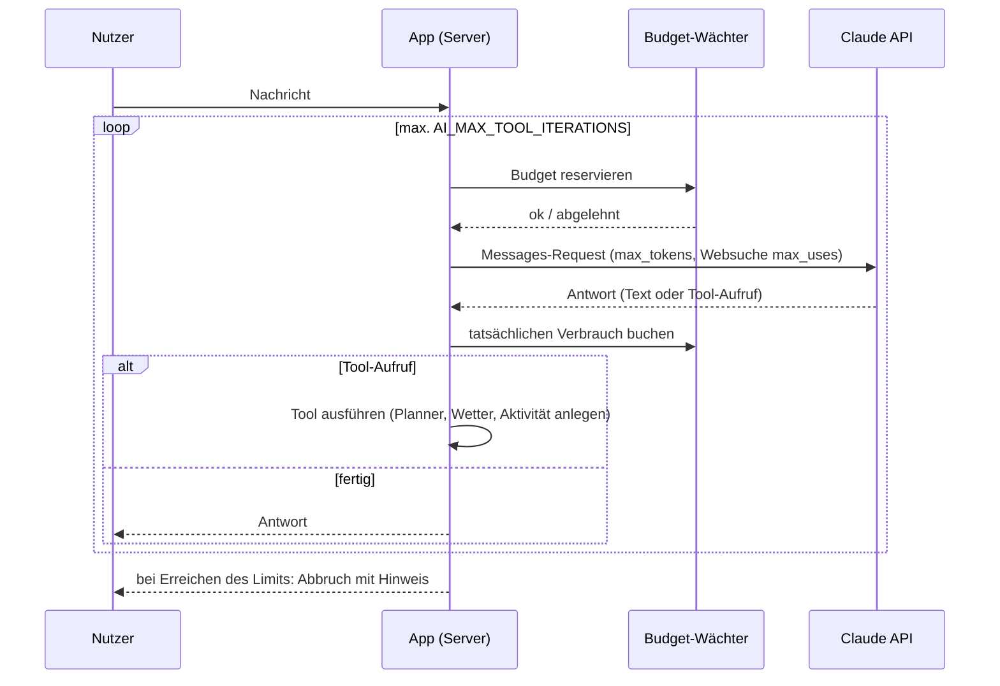

# 6. Laufzeitsicht

## Plan generieren

```mermaid
sequenceDiagram
    participant U as Nutzer
    participant A as App (Server)
    participant W as WeatherProvider
    participant P as Planner (core)
    participant PL as PlacesProvider
    U->>A: Zeitfenster, Budget, Verkehrsmittel, Vorlieben
    A->>W: Vorhersage für Ort + Zeitfenster
    A->>P: Kandidaten filtern (Budget, Wetter, Zeit, Verkehrsmittel, gesperrt)
    P->>P: Scoren + gewichteter Zufall → Reihenfolge
    loop pro Programmpunkt, max. PLACES_MAX_LOOKUPS_PER_PLAN Ortsabfragen gesamt
        P->>PL: Orte vom Typ X im Umkreis (über Budget-Wächter)
        alt Treffer + geöffnet
            P->>P: Programmpunkt übernehmen
        else kein Treffer / Limit erreicht
            P->>P: nächster Kandidat (Aktivitäten ohne Ortstyp brauchen keine Abfrage)
        end
    end
    P-->>A: Ablaufplan (Uhrzeiten, Kosten, Anreise)
    A-->>U: Plan + Links
```

Zu Hause-Aktivitäten brauchen keine Ortsabfrage; ist das Places-Limit erreicht, bleibt deshalb immer ein gültiger Plan möglich.

## Chat mit Tool Use

```mermaid
sequenceDiagram
    participant U as Nutzer
    participant A as App (Server)
    participant G as Budget-Wächter
    participant C as Claude API
    U->>A: Nachricht
    loop max. AI_MAX_TOOL_ITERATIONS
        A->>G: Budget reservieren
        G-->>A: ok / abgelehnt
        A->>C: Messages-Request (max_tokens, Websuche max_uses)
        C-->>A: Antwort (Text oder Tool-Aufruf)
        A->>G: tatsächlichen Verbrauch buchen
        alt Tool-Aufruf
            A->>A: Tool ausführen (Planner, Wetter, Aktivität anlegen)
        else fertig
            A-->>U: Antwort
        end
    end
    A-->>U: bei Erreichen des Limits: Abbruch mit Hinweis
```
